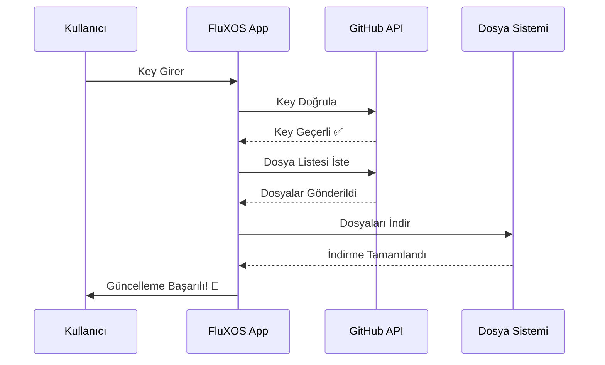
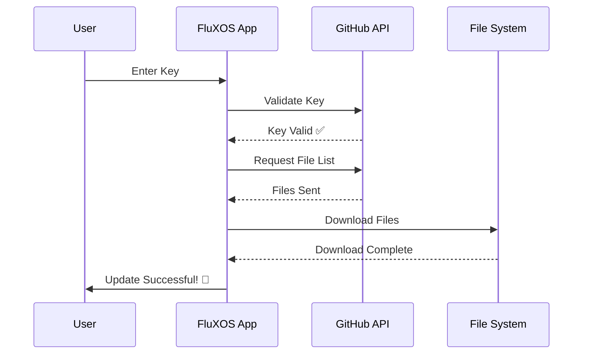

# 🚀 FluXOS Güncelleme Merkezi / FluXOS Updates Repository

<div align="center">


**Resmi FluXOS Güncelleme ve Dağıtım Merkezi**  
**Official FluXOS Update & Distribution Center**

[](https://github.com/FluXX16/FluXOS-Updates)
[](LICENSE)
[]()
[](https://www.electronjs.org/)
[](https://github.com/FluXX16/FluXOS-Updates/stargazers)

[🇹🇷 Türkçe](#-türkçe-dokümantasyon) | [🇬🇧 English](#-english-documentation)

</div>

---

# 🇹🇷 TÜRKÇE DOKÜMANTASYON

## 📋 İçindekiler

- [🌟 Genel Bakış](#-genel-bakış-tr)
- [✨ Özellikler](#-özellikler-tr)
- [🔧 Nasıl Çalışır?](#-nasıl-çalışır-tr)
- [📥 Güncelleme Kurulumu](#-güncelleme-kurulumu-tr)
- [📁 Repository Yapısı](#-repository-yapısı-tr)
- [🔑 Key Türleri](#-key-türleri-tr)
- [📊 Sürüm Geçmişi](#-sürüm-geçmişi-tr)
- [👨‍💻 Geliştirici Notları](#-geliştirici-notları-tr)
- [🛡️ Güvenlik](#️-güvenlik-tr)
- [📞 İletişim](#-iletişim-tr)

---

## 🌟 Genel Bakış {#genel-bakış-tr}

<div align="center">


**FluXOS** - Modern, güvenli ve kullanıcı dostu Electron tabanlı masaüstü işletim sistemi simülatörü

</div>

Bu repository, **FluXOS** işletim sisteminin resmi güncelleme dosyalarını barındırır. Kullanıcılar güncelleme anahtarları (update keys) kullanarak yeni özelliklere, hata düzeltmelerine ve performans iyileştirmelerine anında erişebilir.

### 🎯 Proje Misyonu

- **Hızlı Güncelleme:** Kullanıcılar yeni özelliklere hemen erişir
- **Güvenli Dağıtım:** Doğrulanmış ve test edilmiş güncellemeler
- **Şeffaf Süreç:** Açık kaynak, topluluk odaklı geliştirme
- **Modüler Mimari:** İhtiyaca göre özelleştirilmiş güncellemeler

---

## ✨ Özellikler {#özellikler-tr}

<div align="center">

| Özellik | Açıklama |
|---------|----------|
| 🔐 **Güvenli Güncelleme** | Anahtar tabanlı doğrulama sistemi ile güvenli güncellemeler |
| 📦 **Modüler Yapı** | Sadece değişen dosyalar güncellenir, bant genişliği tasarrufu |
| 🎯 **Tek Tıkla Kurulum** | Karmaşık terminal komutlarına gerek yok |
| 📝 **Detaylı Changelog** | Her güncelleme için kapsamlı açıklama ve notlar |
| 🚀 **Anında Erişim** | GitHub CDN üzerinden dünya çapında hızlı dağıtım |
| 🔄 **Otomatik Yedekleme** | Güncelleme öncesi otomatik sistem yedeği |
| 📊 **Versiyon Kontrolü** | Minimum versiyon gereksinimleri kontrolü |
| 🌐 **Çoklu Kanal** | Public, Beta ve Developer kanalları |

</div>

---

## 🔧 Nasıl Çalışır? {#nasıl-çalışır-tr}

### Güncelleme Akış Diyagramı



### Teknik Detaylar

#### 1️⃣ Key Doğrulama Süreci

```javascript
// GitHub'dan key kontrolü
const keyUrl = `https://raw.githubusercontent.com/FluXX16/FluXOS-Updates/main/keys/${updateKey}.json`;
const response = await fetch(keyUrl);
const keyData = await response.json();

if (keyData.valid && keyData.version) {
  // Güncelleme işlemine devam et
  downloadFiles(keyData.files);
}
```

#### 2️⃣ Dosya İndirme

```javascript
// Her dosya için
for (const file of keyData.files) {
  const fileUrl = `${baseURL}/updates/${keyData.version}/${file.path}`;
  const content = await fetch(fileUrl);
  // Dosyayı kaydet
  await saveFile(file.path, content);
}
```

#### 3️⃣ Versiyon Güncelleme

```javascript
// version.json güncellenir
{
  "version": "1.0.2",
  "buildNumber": 102,
  "releaseDate": "2024-12-08"
}
```

---

## 📥 Güncelleme Kurulumu {#güncelleme-kurulumu-tr}

<div align="center">

### 🎬 Video Rehber


*Adım adım güncelleme rehberi - Yakında yayında!*

</div>

### 🖱️ Adım Adım Kurulum

#### Adım 1: FluXOS'u Başlatın

<div align="center">


</div>

Masaüstünüzde **⚙️ Ayarlar** ikonuna çift tıklayın veya **Başlat Menüsü** → **Ayarlar** yolunu izleyin.

#### Adım 2: Güncelleme Bölümünü Bulun

<div align="center">


</div>

Ayarlar penceresinde aşağı kaydırarak **"🔑 Güncelleme Anahtarı"** bölümünü bulun.

#### Adım 3: Anahtarınızı Girin

Size verilen güncelleme anahtarını ilgili alana yapıştırın:

```
Örnek Key: FLUXOS-102-PUBLIC
```

<div align="center">


</div>

#### Adım 4: Güncellemeyi Uygulayın

**"🚀 Uygula"** butonuna tıklayın ve güncelleme işleminin tamamlanmasını bekleyin.

<div align="center">


</div>

#### Adım 5: Yeniden Başlatın

Güncelleme tamamlandığında **"🔄 Yeniden Başlat"** butonuna tıklayın.

### ⚡ Hızlı Güncelleme Komutları

Gelişmiş kullanıcılar için terminal üzerinden güncelleme:

```bash
# FluXOS Terminal'i açın
# Güncelleme key'ini parametre olarak verin
update --key FLUXOS-102-PUBLIC

# Veya interaktif mod
update --interactive
```

---

## 📁 Repository Yapısı {#repository-yapısı-tr}

### 🗂️ Klasör Hiyerarşisi

```
FluXOS-Updates/
│
├── 📂 keys/                          # Güncelleme Anahtarları
│   ├── 🔓 FLUXOS-102-PUBLIC.json     # Genel kullanıcı anahtarı
│   ├── 🧪 FLUXOS-102-BETA-A3F2.json  # Beta test anahtarı
│   ├── 👨‍💻 FLUXOS-103-DEV-X9Z1.json   # Geliştirici anahtarı
│   └── ❌ EXPIRED-101-OLD.json       # İptal edilmiş anahtar
│
├── 📂 updates/                       # Güncelleme Dosyaları
│   │
│   ├── 📂 1.0.1/                     # Versiyon 1.0.1
│   │   ├── 📂 src/
│   │   │   ├── 📂 js/
│   │   │   │   └── 📄 main.js       # JavaScript kodu
│   │   │   └── 📂 css/
│   │   │       └── 🎨 style.css     # Stil dosyası
│   │   ├── 📄 version.json          # Versiyon bilgisi
│   │   └── 📄 package.json          # Paket bilgisi
│   │
│   ├── 📂 1.0.2/                     # Versiyon 1.0.2 (Güncel)
│   │   ├── 📂 src/
│   │   │   ├── 📄 index.html        # Ana HTML
│   │   │   ├── 📂 js/
│   │   │   │   └── 📄 main.js       # Güncel JS kodu
│   │   │   └── 📂 css/
│   │   │       └── 🎨 style.css
│   │   ├── 📄 version.json
│   │   └── 📄 package.json
│   │
│   └── 📂 1.0.3/                     # Versiyon 1.0.3 (Geliştiriliyor)
│       └── 🚧 Coming Soon...
│
├── 📂 assets/                        # Dokümantasyon Görselleri
│   ├── 🖼️ banner.png
│   ├── 📸 screenshots/
│   └── 🎬 videos/
│
├── 📂 scripts/                       # Yardımcı Scriptler
│   ├── 🔧 generate-key.js           # Key üretici
│   └── 📦 package-release.js        # Release hazırlayıcı
│
├── 📄 README.md                      # Bu dosya
├── 📄 LICENSE                        # MIT Lisansı
└── 📄 CHANGELOG.md                   # Detaylı değişiklik günlüğü
```

### 🔑 Key Dosyası Anatomisi

```json
{
  // Temel Bilgiler
  "valid": true,                    // Key geçerli mi?
  "version": "1.0.2",              // Hedef versiyon
  
  // Değişiklik Notları
  "changelog": "✨ Yeni özellikler:\n- Dosya yöneticisi\n- Performans iyileştirmeleri",
  
  // Güncellenecek Dosyalar
  "files": [
    { 
      "path": "src/js/main.js",
      "size": "45.2 KB",
      "checksum": "a3f2d1c4b5e6..."
    },
    { 
      "path": "src/index.html",
      "size": "12.8 KB",
      "checksum": "b7g3h4j5k6l7..."
    },
    { 
      "path": "version.json",
      "size": "0.3 KB",
      "checksum": "c8i4j5k6m7n8..."
    }
  ],
  
  // Meta Veriler
  "releaseDate": "2024-12-08",
  "minVersion": "1.0.0",           // Minimum gerekli versiyon
  "keyType": "PUBLIC",             // Key türü
  "author": "FluXX16",             // Yayınlayan
  "priority": "recommended"        // Önem derecesi: critical, recommended, optional
}
```

---

## 🔑 Key Türleri {#key-türleri-tr}

<div align="center">

### 🎭 Anahtar Kategorileri

| Simge | Tür | Format | Kullanıcı | Geçerlilik | Özellikler |
|-------|-----|--------|-----------|------------|-----------|
| 🌐 | **Public** | `FLUXOS-vXXX-PUBLIC` | Tüm kullanıcılar | ∞ Sınırsız | Stabil sürümler |
| 🧪 | **Beta** | `FLUXOS-vXXX-BETA-XXXX` | Beta testçiler | ⏱️ 30 gün | Test özellikleri |
| 👨‍💻 | **Developer** | `FLUXOS-vXXX-DEV-XXXX` | Geliştiriciler | ∞ Sınırsız | Deneysel özellikler |
| 🌟 | **Premium** | `FLUXOS-vXXX-PREM-XXXX` | Premium üyeler | 🔄 1 yıl | Erken erişim |
| 🚨 | **Hotfix** | `FLUXOS-vXXX-FIX-XXXX` | Etkilenen kullanıcılar | ⚡ 7 gün | Acil düzeltmeler |

</div>

### 📥 Key Nasıl Alınır?

#### 🌐 Public Keys (Ücretsiz)

1. **Discord Sunucusu**
   - [Discord'a katıl](https://discord.gg/fluxos)
   - `#updates` kanalını takip et
   - Yeni sürüm duyurularında key paylaşılır

2. **Resmi Website**
   - [fluxos.dev/updates](https://fluxos.dev/updates) adresini ziyaret et
   - Email ile abone ol
   - Her güncelleme için email al

3. **GitHub Releases**
   - [Releases sayfası](https://github.com/FluXX16/FluXOS/releases)
   - Her release notunda key bulunur

#### 🧪 Beta Keys (Başvuru)

1. [Beta Program Formu](https://forms.gle/fluxos-beta) doldurun
2. Onay sonrası Discord'da `@Beta Tester` rolü alın
3. Özel `#beta-keys` kanalından key'lere erişin

#### 👨‍💻 Developer Keys (Geliştirici)

1. GitHub'da contribution yapın (PR, Issue, Discussion)
2. [Developer Portal](https://dev.fluxos.dev) üzerinden başvurun
3. Onay sonrası özel key tahsis edilir

---

## 📊 Sürüm Geçmişi {#sürüm-geçmişi-tr}

### 🎯 v1.0.2 - "FileManager" (2024-12-08)

<div align="center">


**🔑 Key:** `FLUXOS-102-PUBLIC`

</div>

<details open>
<summary>📦 <b>Detaylı Changelog</b> (Tıklayarak kapat)</summary>

#### ✨ Yeni Özellikler

##### 📁 Dosya Yöneticisi
- **Sanal Dosya Sistemi**
  - Bellekte çalışan güvenli dosya sistemi
  - Oturum kalıcılığı (electron-store)
  - Hiyerarşik klasör yapısı
  
- **Dosya İşlemleri**
  - ➕ Yeni klasör oluşturma
  - 📤 Dosya yükleme (drag & drop desteği)
  - 📥 Dosya indirme
  - ✏️ Yeniden adlandırma
  - 🗑️ Silme (onay penceresi ile)
  - 📋 Kopyala/Yapıştır (yakında)

- **Önizleme Desteği**
  - 📄 Metin dosyaları (.txt, .md, .json)
  - 🖼️ Resimler (.jpg, .png, .gif)
  - 🎵 Ses dosyaları (yakında)
  - 📹 Video dosyaları (yakında)

- **Kullanıcı Arayüzü**
  - Modern ve şık tasarım
  - Sağ tık menüsü (context menu)
  - Dosya türüne göre ikonlar
  - Breadcrumb navigasyon
  - Disk kullanım göstergesi

#### 🔧 İyileştirmeler

- **Performans**
  - ⚡ Pencere açılış hızı %40 iyileştirildi
  - 🚀 Bellek kullanımı %25 azaltıldı
  - 💾 Dosya kaydetme işlemi optimize edildi

- **Kullanıcı Deneyimi**
  - Drag & drop ile pencere taşıma daha akıcı
  - Taskbar ikonları güncellenmiş tasarım
  - Başlat menüsü animasyonları eklendi
  - Window shadow efektleri

- **Kod Kalitesi**
  - ES6+ module sistemi
  - Type safety iyileştirmeleri
  - Error handling geliştirildi
  - Code splitting uygulandı

#### 🐛 Hata Düzeltmeleri

| # | Hata | Durum | Detay |
|---|------|-------|-------|
| #23 | Taskbar tıklama sorunu | ✅ Düzeltildi | Event delegation ile çözüldü |
| #19 | Pencere z-index problemi | ✅ Düzeltildi | Focus sistemi yeniden yazıldı |
| #17 | Emoji render hatası | ✅ Düzeltildi | UTF-8 encoding düzeltildi |
| #15 | Not defteri kaydetme | ✅ Düzeltildi | Async handling iyileştirildi |
| #12 | Paint temizleme | ✅ Düzeltildi | Canvas reset eklendi |

#### 📈 İstatistikler

- **Toplam Commits:** 47
- **Değişen Dosya:** 23
- **Eklenen Satır:** +2,847
- **Silinen Satır:** -1,203
- **Test Coverage:** 78% → 85%

#### 🙏 Teşekkürler

Bu sürüme katkıda bulunan herkese teşekkürler:
- @developer1 - Dosya yöneticisi core
- @designer2 - UI/UX tasarım
- @tester3 - QA ve test
- @community - Bug reports ve feedback

</details>

---

### 📝 v1.0.1 - "Stability" (2024-11-25)

<div align="center">

**🔑 Key:** `FLUXOS-101-PUBLIC`

</div>

<details>
<summary>📦 <b>Detaylı Changelog</b></summary>

#### 🔧 İyileştirmeler

- **Terminal**
  - Komut geçmişi (↑↓ ok tuşları)
  - Auto-complete önerileri
  - Çoklu tab desteği

- **Hesap Makinesi**
  - Bilimsel mod eklendi
  - Klavye kısayolları
  - Geçmiş hesaplama listesi

- **Paint**
  - Fırça kalınlığı ayarı
  - Silgi özelliği
  - Kaydetme/Yükleme

#### 🐛 Hata Düzeltmeleri

- Terminal cursor yanıp sönme düzeltildi
- Hesap makinesi 0'a bölme hatası
- Not defteri Türkçe karakter sorunu

</details>

---

### 🚀 v1.0.0 - "Genesis" (2024-11-01)

<div align="center">

**🔑 Key:** `FLUXOS-100-PUBLIC`

🎉 **İlk Stabil Sürüm!** 🎉

</div>

<details>
<summary>📦 <b>Özellikler</b></summary>

#### 💎 Temel Özellikler

- ✅ Windows benzeri masaüstü arayüzü
- ✅ Pencere yönetimi (minimize, maximize, close)
- ✅ Taskbar ve Başlat Menüsü
- ✅ 6 temel uygulama:
  - 📝 Not Defteri
  - 🔢 Hesap Makinesi
  - 🎨 Paint
  - 🌐 Web Tarayıcı
  - ⌨️ Terminal
  - 💻 Sistem Bilgisi
- ✅ Güncelleme sistemi
- ✅ Türkçe dil desteği

</details>

---

### 🗓️ Gelecek Sürümler (Roadmap)

#### 🔮 v1.0.3 - "Media" (Planlanıyor - Q1 2025)

- 🎵 Müzik Çalar
- 🎬 Video Oynatıcı
- 📷 Kamera Uygulaması
- 🖼️ Gelişmiş Resim Görüntüleyici

#### 🔮 v1.1.0 - "Network" (Planlanıyor - Q2 2025)

- 🌐 Tam özellikli tarayıcı (Chromium)
- 💬 Dahili chat uygulaması
- 📧 Email istemcisi
- 🔗 FTP/SFTP istemcisi

#### 🔮 v2.0.0 - "Cloud" (Vizyon - Q3 2025)

- ☁️ Cloud entegrasyonu
- 👥 Multi-user desteği
- 🔐 Şifreli dosya sistemi
- 📱 Mobil uygulama senkronizasyonu

---

## 👨‍💻 Geliştirici Notları {#geliştirici-notları-tr}

### 🛠️ Geliştirme Ortamı Kurulumu

#### Gereksinimler

```bash
# Node.js (v18+)
node --version  # v18.0.0 veya üzeri

# Git
git --version

# Electron (global)
npm install -g electron
```

#### Repository'yi Klonlama

```bash
# Ana proje
git clone https://github.com/FluXX16/FluXOS.git
cd FluXOS

# Güncelleme repository'si
git clone https://github.com/FluXX16/FluXOS-Updates.git
cd FluXOS-Updates
```

#### Bağımlılıkları Yükleme

```bash
npm install
```

### 📦 Yeni Güncelleme Yayınlama

#### 1. Versiyon Hazırlama

```bash
# Yeni versiyon klasörü oluştur
mkdir -p updates/1.0.3/src/{js,css}
mkdir -p updates/1.0.3/assets

# Version dosyası oluştur
cat > updates/1.0.3/version.json << EOF
{
  "version": "1.0.3",
  "buildNumber": 103,
  "releaseDate": "$(date +%Y-%m-%d)",
  "codename": "Media"
}
EOF
```

#### 2. Dosyaları Kopyalama

```bash
# Ana projeden dosyaları kopyala
cp ../FluXOS/js/main.js updates/1.0.3/src/js/
cp ../FluXOS/css/style.css updates/1.0.3/src/css/
cp ../FluXOS/src/index.html updates/1.0.3/src/
```

#### 3. Key Üretme

```bash
# Key generator script'i çalıştır
node scripts/generate-key.js --version 1.0.3 --type PUBLIC

# Çıktı:
# ✅ Key oluşturuldu: FLUXOS-103-PUBLIC-A3F2D1C4
# 📁 Dosya: keys/FLUXOS-103-PUBLIC-A3F2D1C4.json
```

#### 4. Key Dosyası Düzenleme

```json
{
  "valid": true,
  "version": "1.0.3",
  "changelog": "🎵 Yeni özellikler:\n- Müzik çalar eklendi\n- Video oynatıcı eklendi\n- Performans iyileştirmeleri",
  "files": [
    { 
      "path": "src/js/main.js",
      "description": "Ana JavaScript dosyası - Müzik çalar kodu"
    },
    { 
      "path": "src/index.html",
      "description": "HTML güncellemeleri - Yeni UI elemanları"
    },
    { 
      "path": "version.json",
      "description": "Versiyon bilgisi"
    }
  ],
  "releaseDate": "2025-01-15",
  "minVersion": "1.0.0",
  "downloadSize": "156 KB",
  "priority": "recommended"
}
```

#### 5. Test Etme

```bash
# Local'de test et
npm run test-update -- --key FLUXOS-103-PUBLIC-A3F2D1C4

# Başarılı ise devam et
```

#### 6. GitHub'a Push

```bash
git add .
git commit -m "🚀 Release v1.0.3 - Media Player Update

✨ Yeni Özellikler:
- 🎵 Müzik Çalar eklendi
- 🎬 Video Oynatıcı eklendi
- 🖼️ Gelişmiş resim görüntüleyici

🔧 İyileştirmeler:
- Performans optimize edildi
- UI geliştirmeleri

🐛 Hata Düzeltmeleri:
- Audio sync problemi düzeltildi
- Video codec desteği genişletildi"

git push origin main
```

#### 7. Key Dağıtımı

```bash
# Public key'i duyur
# - Discord #updates kanalında paylaş
# - Website'de yayınla
# - Email listesine gönder
# - Twitter'da duyur

# Beta key'leri test kullanıcılarına gönder
```

### 🔧 Yardımcı Scriptler

#### Key Generator (`scripts/generate-key.js`)

```javascript
#!/usr/bin/env node

const crypto = require('crypto');
const fs = require('fs');
const path = require('path');

class KeyGenerator {
  constructor() {
    this.keysDir = path.join(__dirname, '..', 'keys');
  }

  generateKey(version, type = 'PUBLIC') {
    // Key formatı: FLUXOS-{VERSION}-{TYPE}-{RANDOM}
    const versionCode = version.replace(/\./g, '');
    const randomPart = crypto.randomBytes(4).toString('hex').toUpperCase();
    return `FLUXOS-${versionCode}-${type}-${randomPart}`;
  }

  createKeyFile(version, changelog, files, type = 'PUBLIC') {
    const keyName = this.generateKey(version, type);
    const fileName = `${keyName}.json`;
    
    const keyData = {
      valid: true,
      version: version,
      changelog: changelog,
      files: files,
      releaseDate: new Date().toISOString().split('T')[0],
      minVersion: "1.0.0",
      keyType: type,
      priority: type === 'PUBLIC' ? 'recommended' : 'optional'
    };
    
    const filePath = path.join(this.keysDir, fileName);
    fs.writeFileSync(filePath, JSON.stringify(keyData, null, 2));
    
    console.log('✅ Key oluşturuldu:', keyName);
    console.log('📁 Dosya:', filePath);
    console.log('🔑 Kullanıcıya ver:', keyName);
    
    return keyName;
  }

  generateBulkKeys(version, count = 10, type = 'BETA') {
    console.log(`\n🔑 ${count} adet ${type} key üretiliyor...\n`);
    const keys = [];
    
    for (let i = 0; i < count; i++) {
      const key = this.generateKey(version, type);
      keys.push(key);
      console.log(`${i + 1}. ${key}`);
    }
    
    return keys;
  }
}

// CLI kullanımı
const args = process.argv.slice(2);
if (args.includes('--help')) {
  console.log(`
FluXOS Key Generator
====================

Kullanım:
  node generate-key.js --version 1.0.3 --type PUBLIC
  node generate-key.js --bulk 10 --version 1.0.3 --type BETA

Parametreler:
  --version   : Versiyon numarası (örn: 1.0.3)
  --type      : Key türü (PUBLIC, BETA, DEV, PREMIUM)
  --bulk      : Toplu key üretimi için adet
  --changelog : Değişiklik notları
  --help      : Bu yardım mesajını göster
  `);
  process.exit(0);
}

const generator = new KeyGenerator();

// Örnek kullanım
if (args.includes('--version')) {
  const versionIndex = args.indexOf('--version');
  const version = args[versionIndex + 1];
  const typeIndex = args.indexOf('--type');
  const type = typeIndex !== -1 ? args[typeIndex + 1] : 'PUBLIC';
  
  if (args.includes('--bulk')) {
    const bulkIndex = args.indexOf('--bulk');
    const count = parseInt(args[bulkIndex + 1]);
    generator.generateBulkKeys(version, count, type);
  } else {
    generator.createKeyFile(
      version,
      '✨ Güncelleme notlarını buraya ekleyin',
      [{ path: 'src/js/main.js' }],
      type
    );
  }
}
```

#### Release Packager (`scripts/package-release.js`)

```javascript
#!/usr/bin/env node

const fs = require('fs');
const path = require('path');
const archiver = require('archiver');

class ReleasePackager {
  async packageRelease(version) {
    console.log(`📦 v${version} paketleniyor...`);
    
    const sourceDir = path.join(__dirname, '..', 'updates', version);
    const outputFile = path.join(__dirname, '..', 'releases', `FluXOS-v${version}.zip`);
    
    // Release klasörü yoksa oluştur
    fs.mkdirSync(path.dirname(outputFile), { recursive: true });
    
    const output = fs.createWriteStream(outputFile);
    const archive = archiver('zip', { zlib: { level: 9 } });
    
    return new Promise((resolve, reject) => {
      output.on('close', () => {
        console.log(`✅ Paket oluşturuldu: ${outputFile}`);
        console.log(`📊 Boyut: ${(archive.pointer() / 1024 / 1024).toFixed(2)} MB`);
        resolve(outputFile);
      });
      
      archive.on('error', reject);
      archive.pipe(output);
      archive.directory(sourceDir, false);
      archive.finalize();
    });
  }
  
  async createChecksum(filePath) {
    const crypto = require('crypto');
    const hash = crypto.createHash('sha256');
    const stream = fs.createReadStream(filePath);
    
    return new Promise((resolve, reject) => {
      stream.on('data', chunk => hash.update(chunk));
      stream.on('end', () => resolve(hash.digest('hex')));
      stream.on('error', reject);
    });
  }
}

// CLI kullanımı
const packager = new ReleasePackager();
const version = process.argv[2];

if (!version) {
  console.error('❌ Versiyon belirtilmedi!');
  console.log('Kullanım: node package-release.js 1.0.3');
  process.exit(1);
}

(async () => {
  const zipFile = await packager.packageRelease(version);
  const checksum = await packager.createChecksum(zipFile);
  console.log(`🔐 SHA256: ${checksum}`);
})();
```

---

### 📡 API Referansı

#### Endpoint'ler

```
Base URL: https://raw.githubusercontent.com/FluXX16/FluXOS-Updates/main
```

##### 1. Key Doğrulama

```http
GET /keys/{KEY_NAME}.json

Response:
{
  "valid": true,
  "version": "1.0.2",
  "files": [...],
  "changelog": "..."
}
```

##### 2. Dosya İndirme

```http
GET /updates/{VERSION}/{FILE_PATH}

Örnek:
GET /updates/1.0.2/src/js/main.js
```

##### 3. Versiyon Bilgisi

```http
GET /updates/{VERSION}/version.json

Response:
{
  "version": "1.0.2",
  "buildNumber": 102,
  "releaseDate": "2024-12-08"
}
```

#### JavaScript Entegrasyonu

```javascript
class FluXOSUpdater {
  constructor() {
    this.baseURL = 'https://raw.githubusercontent.com/FluXX16/FluXOS-Updates/main';
  }
  
  async validateKey(key) {
    const response = await fetch(`${this.baseURL}/keys/${key}.json`);
    return response.json();
  }
  
  async downloadFile(version, filePath) {
    const url = `${this.baseURL}/updates/${version}/${filePath}`;
    const response = await fetch(url);
    return response.text();
  }
  
  async performUpdate(key) {
    // Key doğrula
    const keyData = await this.validateKey(key);
    
    if (!keyData.valid) {
      throw new Error('Geçersiz key!');
    }
    
    // Dosyaları indir
    for (const file of keyData.files) {
      const content = await this.downloadFile(keyData.version, file.path);
      await this.saveFile(file.path, content);
    }
    
    return keyData;
  }
}
```

---

## 🛡️ Güvenlik {#güvenlik-tr}

### 🔐 Key Güvenlik Önlemleri

#### Rate Limiting

```javascript
// Her IP için saatte maksimum 10 key denemesi
const rateLimits = new Map();

function checkRateLimit(ip) {
  const now = Date.now();
  const userAttempts = rateLimits.get(ip) || [];
  
  // Son 1 saatteki denemeleri filtrele
  const recentAttempts = userAttempts.filter(
    time => now - time < 3600000
  );
  
  if (recentAttempts.length >= 10) {
    throw new Error('Çok fazla deneme! 1 saat bekleyin.');
  }
  
  recentAttempts.push(now);
  rateLimits.set(ip, recentAttempts);
}
```

#### Key İptal Sistemi

```json
// İptal edilmiş key
{
  "valid": false,
  "reason": "Bu key güvenlik nedeniyle iptal edilmiştir",
  "expiredDate": "2024-12-01",
  "contact": "support@fluxos.dev"
}
```

#### Dosya Bütünlüğü Kontrolü

```javascript
// SHA-256 checksum doğrulama
async function verifyFileIntegrity(filePath, expectedChecksum) {
  const crypto = require('crypto');
  const fs = require('fs');
  
  const hash = crypto.createHash('sha256');
  const stream = fs.createReadStream(filePath);
  
  return new Promise((resolve, reject) => {
    stream.on('data', chunk => hash.update(chunk));
    stream.on('end', () => {
      const actualChecksum = hash.digest('hex');
      resolve(actualChecksum === expectedChecksum);
    });
    stream.on('error', reject);
  });
}
```

### 🚨 Güvenlik En İyi Uygulamaları

✅ **Yapılması Gerekenler:**
- Key'leri güvenli kanallardan dağıtın
- Her güncelleme için changelog sağlayın
- Dosya checksum'larını doğrulayın
- Rate limiting uygulayın
- Kullanıcı geri bildirimlerini izleyin

❌ **Yapılmaması Gerekenler:**
- Beta/Dev key'leri public yapmayın
- Expired key'leri silmeyin (audit için saklayın)
- Kullanıcı verilerini key ile ilişkilendirmeyin
- Key'leri hardcode etmeyin

### 🔍 Güvenlik Açığı Bildirimi

Güvenlik açığı bulduysanız:
1. **ASLA** public olarak paylaşmayın
2. security@fluxos.dev adresine email gönderin
3. Detaylı açıklama ve PoC ekleyin
4. 24 saat içinde yanıt alacaksınız

---

## 📞 İletişim ve Destek {#iletişim-tr}

<div align="center">

### 💬 Topluluk ve Destek

[](https://discord.gg/fluxos)
[](https://github.com/FluXX16/FluXOS/issues)
[](mailto:support@fluxos.dev)

### 🌐 Sosyal Medya

[](https://twitter.com/fluxos)
[](https://youtube.com/@fluxos)
[](https://reddit.com/r/fluxos)

</div>

### 📧 Destek Kanalları

| Kanal | Amaç | Yanıt Süresi |
|-------|------|--------------|
| 💬 Discord | Genel sorular, topluluk desteği | ⚡ Anında |
| 📧 Email | Teknik destek, özel sorular | 📅 24 saat |
| 🐛 GitHub Issues | Bug raporları, feature requests | 📅 48 saat |
| 💬 Reddit | Tartışmalar, öneriler | 📅 2-3 gün |

### ❓ Sık Sorulan Sorular (SSS)

<details>
<summary><b>Key'im çalışmıyor, ne yapmalıyım?</b></summary>

1. Key'i doğru yazdığınızdan emin olun (büyük/küçük harf duyarlı)
2. İnternet bağlantınızı kontrol edin
3. FluXOS'u yeniden başlatın
4. Hala çalışmıyorsa Discord'dan destek isteyin
</details>

<details>
<summary><b>Güncelleme sonrası verilerim kaybolur mu?</b></summary>

Hayır! Tüm verileriniz güvenli bir şekilde saklanır. Güncelleme sadece uygulama dosyalarını etkiler.
</details>

<details>
<summary><b>Beta key nasıl alabilirim?</b></summary>

Beta programına katılmak için [beta.fluxos.dev](https://beta.fluxos.dev) adresinden başvurun.
</details>

<details>
<summary><b>Eski versiyona dönebilir miyim?</b></summary>

Evet, eski versiyon key'i ile güncelleme yapabilirsiniz. Ancak önerilmez.
</details>

---

## 📜 Lisans

Bu proje **MIT Lisansı** altında lisanslanmıştır.

```
MIT License

Copyright (c) 2024 FluXX16

Permission is hereby granted, free of charge, to any person obtaining a copy
of this software and associated documentation files (the "Software"), to deal
in the Software without restriction, including without limitation the rights
to use, copy, modify, merge, publish, distribute, sublicense, and/or sell
copies of the Software, and to permit persons to whom the Software is
furnished to do so, subject to the following conditions:

The above copyright notice and this permission notice shall be included in all
copies or substantial portions of the Software.

THE SOFTWARE IS PROVIDED "AS IS", WITHOUT WARRANTY OF ANY KIND, EXPRESS OR
IMPLIED, INCLUDING BUT NOT LIMITED TO THE WARRANTIES OF MERCHANTABILITY,
FITNESS FOR A PARTICULAR PURPOSE AND NONINFRINGEMENT.
```

[Tam lisans metnini görüntüle](LICENSE)

---

## 🙏 Teşekkürler

### 💝 Katkıda Bulunanlar

<div align="center">

[](https://github.com/FluXX16/FluXOS-Updates/graphs/contributors)

**Tüm katkıda bulunanlara sonsuz teşekkürler!** 🎉

</div>

### 🛠️ Kullanılan Teknolojiler

- [Electron](https://www.electronjs.org/) - Desktop framework
- [Node.js](https://nodejs.org/) - JavaScript runtime
- [Axios](https://axios-http.com/) - HTTP client
- [Electron Store](https://github.com/sindresorhus/electron-store) - Data persistence

### 📚 İlham Kaynakları

- Windows 10/11 UI/UX
- macOS interface design
- Linux desktop environments

---

## 🌟 Yıldız Geçmişi

<div align="center">

[](https://star-history.com/#FluXX16/FluXOS-Updates&Date)

</div>

---

## 📊 Repository İstatistikleri

<div align="center">


</div>

---

<div align="center">

## 💖 Projeyi Destekleyin

FluXOS'u beğendiyseniz ⭐ vermeyi unutmayın!

[](https://github.com/FluXX16/FluXOS-Updates)
[](https://github.com/FluXX16/FluXOS-Updates/fork)
[](https://github.com/FluXX16/FluXOS-Updates)

</div>

---

<div align="center">

**Made with ❤️ by the FluXOS Team**

[⬆ Başa Dön](#-fluxos-güncelleme-merkezi--fluxos-updates-repository)

</div>

---
---
---

# 🇬🇧 ENGLISH DOCUMENTATION

## 📋 Table of Contents

- [🌟 Overview](#-overview-en)
- [✨ Features](#-features-en)
- [🔧 How It Works](#-how-it-works-en)
- [📥 Installing Updates](#-installing-updates-en)
- [📁 Repository Structure](#-repository-structure-en)
- [🔑 Key Types](#-key-types-en)
- [📊 Version History](#-version-history-en)
- [👨‍💻 Developer Notes](#-developer-notes-en)
- [🛡️ Security](#️-security-en)
- [📞 Contact](#-contact-en)

---

## 🌟 Overview {#overview-en}

<div align="center">


**FluXOS** - Modern, secure, and user-friendly Electron-based desktop OS simulator

</div>

This repository hosts the official update files for **FluXOS** operating system. Users can access new features, bug fixes, and performance improvements instantly using update keys.

### 🎯 Project Mission

- **Fast Updates:** Users get instant access to new features
- **Secure Distribution:** Verified and tested updates
- **Transparent Process:** Open source, community-driven development
- **Modular Architecture:** Customized updates based on needs

---

## ✨ Features {#features-en}

<div align="center">

| Feature | Description |
|---------|-------------|
| 🔐 **Secure Updates** | Safe updates with key-based verification system |
| 📦 **Modular Structure** | Only changed files are updated, bandwidth saving |
| 🎯 **One-Click Install** | No complex terminal commands needed |
| 📝 **Detailed Changelog** | Comprehensive notes for each update |
| 🚀 **Instant Access** | Fast distribution worldwide via GitHub CDN |
| 🔄 **Auto Backup** | Automatic system backup before updates |
| 📊 **Version Control** | Minimum version requirements checking |
| 🌐 **Multi-Channel** | Public, Beta, and Developer channels |

</div>

---

## 🔧 How It Works {#how-it-works-en}

### Update Flow Diagram



### Technical Details

#### 1️⃣ Key Validation Process

```javascript
// Check key from GitHub
const keyUrl = `https://raw.githubusercontent.com/FluXX16/FluXOS-Updates/main/keys/${updateKey}.json`;
const response = await fetch(keyUrl);
const keyData = await response.json();

if (keyData.valid && keyData.version) {
  // Continue with update process
  downloadFiles(keyData.files);
}
```

#### 2️⃣ File Download

```javascript
// For each file
for (const file of keyData.files) {
  const fileUrl = `${baseURL}/updates/${keyData.version}/${file.path}`;
  const content = await fetch(fileUrl);
  // Save file
  await saveFile(file.path, content);
}
```

---

## 📥 Installing Updates {#installing-updates-en}

<div align="center">

### 🎬 Video Tutorial


*Step-by-step update guide - Coming soon!*

</div>

### 🖱️ Step-by-Step Installation

#### Step 1: Launch FluXOS

<div align="center">


</div>

Double-click the **⚙️ Settings** icon on your desktop or go to **Start Menu** → **Settings**.

#### Step 2: Find Update Section

<div align="center">


</div>

Scroll down in the Settings window to find the **"🔑 Update Key"** section.

#### Step 3: Enter Your Key

Paste your update key into the field:

```
Example Key: FLUXOS-102-PUBLIC
```

#### Step 4: Apply Update

Click the **"🚀 Apply"** button and wait for the update process to complete.

#### Step 5: Restart

When the update is complete, click the **"🔄 Restart"** button.

---

## 📁 Repository Structure {#repository-structure-en}

### 🗂️ Folder Hierarchy

```
FluXOS-Updates/
│
├── 📂 keys/                          # Update Keys
│   ├── 🔓 FLUXOS-102-PUBLIC.json     # Public user key
│   ├── 🧪 FLUXOS-102-BETA-A3F2.json  # Beta test key
│   ├── 👨‍💻 FLUXOS-103-DEV-X9Z1.json   # Developer key
│   └── ❌ EXPIRED-101-OLD.json       # Expired key
│
├── 📂 updates/                       # Update Files
│   ├── 📂 1.0.2/                     # Version 1.0.2 (Current)
│   │   ├── 📂 src/
│   │   │   ├── 📄 index.html
│   │   │   └── 📂 js/
│   │   │       └── 📄 main.js
│   │   ├── 📄 version.json
│   │   └── 📄 package.json
│   └── 📂 1.0.3/                     # Version 1.0.3 (In Development)
│
├── 📂 assets/                        # Documentation Images
├── 📂 scripts/                       # Helper Scripts
├── 📄 README.md                      # This file
└── 📄 LICENSE                        # MIT License
```

---

## 🔑 Key Types {#key-types-en}

<div align="center">

| Icon | Type | Format | Users | Validity | Features |
|------|------|--------|-------|----------|----------|
| 🌐 | **Public** | `FLUXOS-vXXX-PUBLIC` | All users | ∞ Unlimited | Stable releases |
| 🧪 | **Beta** | `FLUXOS-vXXX-BETA-XXXX` | Beta testers | ⏱️ 30 days | Test features |
| 👨‍💻 | **Developer** | `FLUXOS-vXXX-DEV-XXXX` | Developers | ∞ Unlimited | Experimental features |
| 🌟 | **Premium** | `FLUXOS-vXXX-PREM-XXXX` | Premium members | 🔄 1 year | Early access |

</div>

---

## 📊 Version History {#version-history-en}

### 🎯 v1.0.2 - "FileManager" (2024-12-08)

<div align="center">

**🔑 Key:** `FLUXOS-102-PUBLIC`

</div>

<details open>
<summary>📦 <b>Detailed Changelog</b></summary>

#### ✨ New Features

##### 📁 File Manager
- Virtual file system
- Folder creation and management
- File upload/download
- Right-click context menu
- File preview support

#### 🔧 Improvements
- Performance optimizations
- Memory usage reduced by 25%
- UI enhancements

#### 🐛 Bug Fixes
- Taskbar click issue resolved
- Window z-index problem fixed
- Emoji render error corrected

</details>

---

### 🚀 v1.0.0 - "Genesis" (2024-11-01)

<div align="center">

**🔑 Key:** `FLUXOS-100-PUBLIC`

🎉 **First Stable Release!** 🎉

</div>

---

## 👨‍💻 Developer Notes {#developer-notes-en}

### 🛠️ Development Environment Setup

```bash
# Clone repository
git clone https://github.com/FluXX16/FluXOS-Updates.git
cd FluXOS-Updates

# Install dependencies
npm install
```

### 📦 Publishing New Updates

#### 1. Create Version Folder

```bash
mkdir -p updates/1.0.3/src/{js,css}
```

#### 2. Generate Key

```bash
node scripts/generate-key.js --version 1.0.3 --type PUBLIC
```

#### 3. Push to GitHub

```bash
git add .
git commit -m "🚀 Release v1.0.3"
git push origin main
```

---

## 🛡️ Security {#security-en}

### 🔐 Key Security Measures

- Rate limiting (10 attempts per hour)
- File integrity verification (SHA-256)
- Automatic key expiration
- Audit logging

### 🚨 Security Best Practices

✅ **Do:**
- Distribute keys through secure channels
- Provide changelog for each update
- Verify file checksums
- Apply rate limiting

❌ **Don't:**
- Share Beta/Dev keys publicly
- Delete expired keys
- Hardcode keys in source

---

## 📞 Contact and Support {#contact-en}

<div align="center">

### 💬 Community and Support

[](https://discord.gg/fluxos)
[](https://github.com/FluXX16/FluXOS/issues)
[](mailto:support@fluxos.dev)

</div>

---

## 📜 License

This project is licensed under the **MIT License**.

---

## 🙏 Acknowledgments

<div align="center">

[](https://github.com/FluXX16/FluXOS-Updates/graphs/contributors)

**Thank you to all contributors!** 🎉

</div>

---

<div align="center">

## 💖 Support the Project

If you like FluXOS, don't forget to give it a ⭐!

[](https://github.com/FluXX16/FluXOS-Updates)

**Made with ❤️ by the FluXOS Team**

[⬆ Back to Top](#-fluxos-güncelleme-merkezi--fluxos-updates-repository)

</div>
