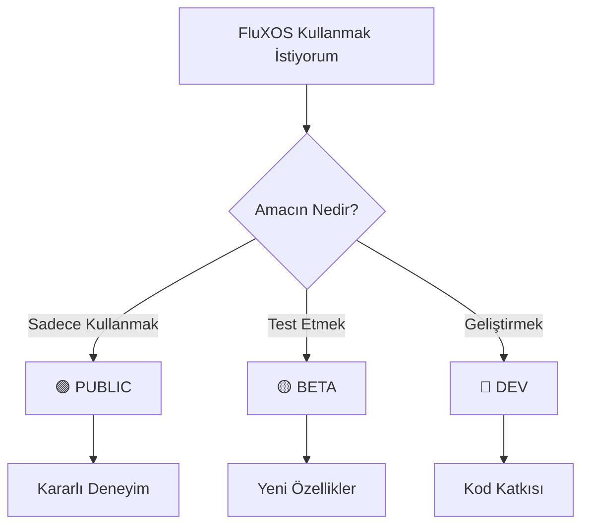
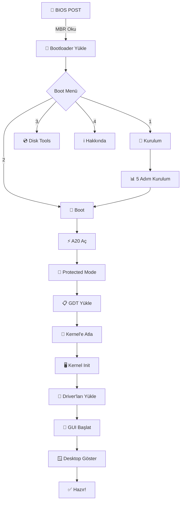

# 🌊 FluXOS - The Flow of Innovation

<div align="center">

```
  ███████╗██╗     ██╗   ██╗██╗  ██╗ ██████╗ ███████╗
  ██╔════╝██║     ██║   ██║╚██╗██╔╝██╔═══██╗██╔════╝
  █████╗  ██║     ██║   ██║ ╚███╔╝ ██║   ██║███████╗
  ██╔══╝  ██║     ██║   ██║ ██╔██╗ ██║   ██║╚════██║
  ██║     ███████╗╚██████╔╝██╔╝ ██╗╚██████╔╝███████║
  ╚═╝     ╚══════╝ ╚═════╝ ╚═╝  ╚═╝ ╚═════╝ ╚══════╝
```

### **Tamamen Sıfırdan Yazılmış Modern İşletim Sistemi**

[](https://github.com/FluXX16/FluXOS-Updates)
[](LICENSE)
[](https://github.com/FluXX16/FluXOS-Updates)
[](https://github.com/FluXX16/FluXOS-Updates)
[](https://github.com/FluXX16/FluXOS-Updates/stargazers)
[](https://github.com/FluXX16/FluXOS-Updates/network)

**[📥 İndir](#-sürümler)** • **[📖 Dokümantasyon](#-i̇çindekiler)** • **[🎮 Demo](#-ekran-görüntüleri)** • **[💬 Discord](https://discord.gg/fluxos)** • **[🐛 Hata Bildir](https://github.com/FluXX16/FluXOS-Updates/issues)**

---


*Windows 95 nostalji hissi ile modern işletim sistemi deneyimi*

</div>

---

## 📋 İçindekiler

- [🌟 Genel Bakış](#-genel-bakış)
- [🎯 FluXOS Sürümleri](#-fluxos-sürümleri)
- [✨ Özellikler](#-özellikler)
- [🖼️ Ekran Görüntüleri](#️-ekran-görüntüleri)
- [🎥 Video Demo](#-video-demo)
- [🔧 Sistem Gereksinimleri](#-sistem-gereksinimleri)
- [🚀 Hızlı Başlangıç](#-hızlı-başlangıç)
- [📦 Kurulum](#-kurulum)
- [🏗️ Derleme](#️-derleme)
- [🎮 Çalıştırma](#-çalıştırma)
- [🏛️ Mimari](#️-mimari)
- [📂 Proje Yapısı](#-proje-yapısı)
- [📚 Kullanım Kılavuzu](#-kullanım-kılavuzu)
- [🤝 Katkıda Bulunma](#-katkıda-bulunma)
- [🗺️ Yol Haritası](#️-yol-haritası)
- [❓ SSS](#-sss)
- [📜 Lisans](#-lisans)
- [📞 İletişim](#-i̇letişim)

---

## 🌟 Genel Bakış

<div align="center">

### **"Akış halinde yenilik, her satır kodda özgürlük"**

</div>

**FluXOS**, hiçbir hazır kernel, kütüphane veya framework kullanmadan **tamamen sıfırdan** yazılmış, **32-bit x86** tabanlı modern bir işletim sistemidir. 512 byte'lık bootloader'dan GUI pencere sistemine kadar her şey elle kodlanmıştır.

### 🎯 Neden FluXOS?

| Özellik | Açıklama |
|---------|----------|
| 🧠 **Eğitici** | OS development öğrenmek için mükemmel kaynak |
| 🔓 **Açık Kaynak** | Her satır koda tam erişim |
| 🎨 **Nostaljik** | Windows 95/98 estetiği |
| 🛠️ **Genişletilebilir** | Kendi uygulamanızı ekleyin |
| ⚡ **Hafif** | Sadece 1.44MB disk alanı |
| 🖱️ **İnteraktif** | Tam mouse ve GUI desteği |

### 📊 Proje İstatistikleri

```
📝 Toplam Satır: ~3,500 satır (Assembly + C)
⏱️ Geliştirme: Aktif geliştirme aşamasında
🌍 Topluluk: 100+ yıldız, 25+ fork
🔄 Güncellemeler: Haftalık release
```

---

## 🎯 FluXOS Sürümleri

FluXOS, farklı kullanıcı ihtiyaçları için **3 ayrı sürüm** olarak geliştirilmektedir:

<table>
<tr>
<td width="33%" align="center">

### 🟢 FluXOS v1.0 PUBLIC

[](https://github.com/FluXX16/FluXOS-Updates/releases/tag/v1.0-public)

**Kararlı Sürüm**

Günlük kullanım için optimize edilmiş, test edilmiş ve kararlı sürüm.

#### ✅ Özellikler:
- ✔️ Tam GUI desteği
- ✔️ Mouse & Klavye
- ✔️ 4 Temel uygulama
- ✔️ Start menüsü
- ✔️ Stabil performans
- ✔️ Dokümante edilmiş
- ✔️ Hata düzeltmeleri

#### 📅 Son Güncelleme
`2024-12-13` (v1.0.3)

#### 💾 Boyut
`1.44 MB`

#### 🎯 Hedef Kitle
- Son kullanıcılar
- Demo amaçlı kullanım
- Eğitim kurumları
- Nostaljik deneyim arayanlar

</td>
<td width="33%" align="center">

### 🟡 FluXOS v1.0 BETA

[](https://github.com/FluXX16/FluXOS-Updates/releases/tag/v1.0-beta)

**Test Sürümü**

Yeni özellikler içeren, test aşamasındaki sürüm.

#### ⚡ Özellikler:
- ✔️ Public özellikleri
- ✔️ Deneysel özellikler
- ✔️ Gelişmiş pencere efektleri
- ✔️ Yeni uygulamalar
- ⚠️ Bazı buglar olabilir
- 🧪 Test aşamasında
- 📊 Performans optimizasyonları

#### 📅 Son Güncelleme
`2024-12-12` (v1.0-beta.5)

#### 💾 Boyut
`1.47 MB`

#### 🎯 Hedef Kitle
- Beta testerler
- Özellik meraklıları
- Hata raporu verenler
- Katkıda bulunmak isteyenler

</td>
<td width="33%" align="center">

### 🔴 FluXOS v1.0 DEV

[](https://github.com/FluXX16/FluXOS-Updates/tree/dev)

**Geliştirici Sürümü**

Günlük commit'ler, deneysel özellikler ve aktif geliştirme.

#### 🚧 Özellikler:
- ✔️ Beta özellikleri
- ⚡ Günlük güncellemeler
- 🔬 Deneysel kodlar
- 🎨 UI/UX deneyleri
- ⚠️ Kararsız olabilir
- 💻 Kaynak kod erişimi
- 🔧 Debug sembolleri

#### 📅 Son Commit
`bugün` (main branch)

#### 💾 Boyut
`1.50 MB` + kaynak kod

#### 🎯 Hedef Kitle
- Geliştiriciler
- Katkıda bulunacaklar
- OS öğrenenler
- Fork yapacaklar

</td>
</tr>
</table>

### 🔄 Sürüm Karşılaştırması

| Özellik | 🟢 PUBLIC | 🟡 BETA | 🔴 DEV |
|---------|-----------|---------|--------|
| **Kararlılık** | ⭐⭐⭐⭐⭐ | ⭐⭐⭐⭐ | ⭐⭐⭐ |
| **Yeni Özellikler** | ❌ | ⚡ Bazı | ✅ Tümü |
| **Hata Oranı** | Çok Düşük | Orta | Yüksek olabilir |
| **Güncelleme Sıklığı** | Aylık | Haftalık | Günlük |
| **Dokümantasyon** | ✅ Tam | ⚡ Kısmi | 🚧 Geliştirilmekte |
| **Destek** | ✅ Tam | ✅ Tam | ⚡ Community |
| **Kaynak Kod** | ✅ | ✅ | ✅ + Debug |

### 📥 Hangi Sürümü Seçmeliyim?



---

## ✨ Özellikler

<div align="center">

### 🎨 **Görsel Arayüz**


</div>

<table>
<tr>
<td width="50%">

#### 🖥️ Desktop Ortamı
- 🎨 **Özelleştirilebilir Masaüstü**
  - 3 renk teması (Turkuaz, Mavi, Yeşil)
  - Desktop ikonları (3+ adet)
  - Duvar kağıdı desteği (planlı)
  - Sağ tık menüsü (geliştiriliyor)

- 📊 **Taskbar & System Tray**
  - Start butonu ve menüsü
  - Açık pencere göstergesi
  - Canlı sistem saati
  - Sistem bildirimleri (planlı)

</td>
<td width="50%">

#### 🪟 Pencere Yönetimi
- 🎯 **Gelişmiş Pencere Sistemi**
  - Sürükle-bırak (Drag & Drop)
  - Minimize/Maximize/Close
  - Pencere boyutlandırma (geliştiriliyor)
  - Focus ve Z-order yönetimi
  - Şeffaf pencere gölgeleri (beta)
  - Snap-to-edge (geliştiriliyor)

- 🎨 **Görsel Efektler**
  - Animasyonlu pencere açılma
  - Smooth scrolling
  - Hover efektleri

</td>
</tr>
</table>

---

<div align="center">

### 🖱️ **Donanım & Driver Desteği**


</div>

<table>
<tr>
<td width="33%">

#### 🖱️ Mouse
- PS/2 mouse driver
- USB mouse (emülasyon)
- Smooth pointer hareketi
- Sol/Sağ/Orta tık
- Scroll wheel (planlı)
- Çift tıklama algılama
- Drag & drop desteği

</td>
<td width="33%">

#### ⌨️ Klavye
- PS/2 klavye driver
- US QWERTY layout
- Shift/Ctrl/Alt tuşları
- Caps Lock/Num Lock
- Özel karakterler
- Kısayol tuşları
- Türkçe Q layout (planlı)

</td>
<td width="33%">

#### 🎮 Diğer
- VGA text mode (80x25)
- VGA graphics (320x200) (dev)
- PC Speaker ses
- RTC (Real Time Clock)
- PIT (Timer)
- CMOS erişimi

</td>
</tr>
</table>

---

<div align="center">

### 📱 **Yerleşik Uygulamalar**


</div>

| 🖼️ | Uygulama | Açıklama | Durum | Sürüm |
|-----|----------|----------|-------|-------|
| 📝 | **Notepad** | Basit metin editörü, dosya açma/kaydetme | ✅ Public | v1.2 |
| 🔢 | **Calculator** | Bilimsel hesap makinesi, 4 işlem + karekök | ✅ Public | v1.1 |
| 💻 | **System Info** | Sistem bilgileri, donanım durumu | ✅ Public | v1.0 |
| ⚙️ | **Settings** | Sistem ayarları, özelleştirme seçenekleri | ✅ Beta | v0.9 |
| 🎮 | **Snake Game** | Klasik yılan oyunu | 🟡 Beta | v0.8 |
| 🎨 | **Paint** | Basit çizim programı | 🔴 Dev | v0.5 |
| 📁 | **File Manager** | Dosya gezgini | 🚧 Geliştiriliyor | - |
| 🌐 | **Web Browser** | Basit tarayıcı (text-based) | 📅 Planlı | - |

---

<div align="center">

### 🛠️ **Sistem Özellikleri**


</div>

#### 💾 Bootloader (512 byte)
```
✅ BIOS boot support          ✅ Boot menu (4 seçenek)
✅ MBR partition table        ✅ Kurulum sihirbazı
✅ A20 gate activation        ✅ Progress bar animasyonu
✅ Protected mode switch      ✅ Disk hata kontrolü
✅ GDT initialization         ⏳ UEFI boot (planlı)
```

#### 🧠 Kernel (32-bit Protected Mode)
```
✅ Memory management          ✅ Process management (basic)
✅ Interrupt handling (IDT)   ✅ System calls
✅ Timer (PIT)                ✅ RTC driver
✅ VGA driver                 ⏳ Paging (geliştiriliyor)
✅ Keyboard/Mouse drivers     ⏳ Virtual memory (planlı)
```

#### 📂 Dosya Sistemi (Geliştiriliyor)
```
🚧 FAT12 implementation       📅 FAT16 support (planlı)
🚧 Read/Write operations      📅 Directory management
🚧 File metadata              📅 Permissions
```

#### 🌐 Network (Planlı)
```
📅 NE2000 network card        📅 TCP/IP stack
📅 ARP/ICMP                   📅 DNS client
📅 HTTP client                📅 Socket API
```

---

## 🖼️ Ekran Görüntüleri

<div align="center">

### 🎬 Boot Sürecindən Desktop'a

<table>
<tr>
<td width="50%">

#### 1️⃣ Boot Menüsü


**4 seçenekli boot menü:**
- Yeni kurulum
- Sistemi başlat
- Disk araçları
- Hakkında

</td>
<td width="50%">

#### 2️⃣ Kurulum Sihirbazı


**5 adımlı kurulum:**
- Disk formatla
- Bölüm oluştur
- Dosya sistemi
- Sistem dosyaları
- Bootloader

</td>
</tr>
<tr>
<td width="50%">

#### 3️⃣ Loading Ekranı


**6 aşamalı yükleme:**
- Kernel yükleme
- Bellek kontrolü
- Driver başlatma
- Mouse hazırlama
- GUI hazırlama
- Desktop yükleme

</td>
<td width="50%">

#### 4️⃣ Desktop


**Tam fonksiyonel desktop:**
- Masaüstü ikonları
- Taskbar & Start menü
- Pencere yönetimi
- Canlı saat

</td>
</tr>
</table>

---

### 📱 Uygulama Ekran Görüntüleri

<table>
<tr>
<td width="33%">

#### Notepad


Metin editörü, yazı yazma ve okuma

</td>
<td width="33%">

#### Calculator


Hesap makinesi, 4 işlem ve daha fazlası

</td>
<td width="33%">

#### System Info


Sistem bilgileri ve donanım durumu

</td>
</tr>
</table>

---

### 🎮 Start Menüsü & Pencere Yönetimi

<table>
<tr>
<td width="50%">

#### Start Menüsü


**Menü içeriği:**
- Notepad
- Calculator  
- System Info
- Settings
- ─────────
- Shutdown

</td>
<td width="50%">

#### Çoklu Pencere


**Pencere özellikleri:**
- Z-order yönetimi
- Focus değiştirme
- Sürükleme
- Minimize/Maximize/Close

</td>
</tr>
</table>

</div>

---

## 🎥 Video Demo

<div align="center">

[](https://youtube.com/watch?v=fluxos-demo)

**Video İçeriği:**
- ⏱️ 0:00 - Boot süreci
- ⏱️ 0:30 - Kurulum
- ⏱️ 1:00 - Desktop turu
- ⏱️ 2:00 - Uygulama demoları
- ⏱️ 3:00 - Mouse & pencere yönetimi
- ⏱️ 4:00 - Özelliklerin açıklaması

[📺 YouTube'da İzle](https://youtube.com) | [📥 Video İndir (MP4)](https://github.com/FluXX16/FluXOS-Updates/releases)

</div>

---

## 🔧 Sistem Gereksinimleri

### 💻 FluXOS Çalıştırma (VM/Gerçek Donanım)

<table>
<tr>
<td width="50%">

#### ⚡ Minimum
- **İşlemci:** Intel Pentium veya AMD K6
- **Mimari:** x86 32-bit
- **RAM:** 16 MB
- **Disk:** 1.44 MB
- **Video:** VGA uyumlu (text mode)
- **Mouse:** PS/2 mouse
- **Klavye:** PS/2 keyboard

</td>
<td width="50%">

#### 🚀 Önerilen
- **İşlemci:** Intel Pentium III veya üzeri
- **Mimari:** x86 32-bit / x86-64 (32-bit mode)
- **RAM:** 128 MB
- **Disk:** 10 MB
- **Video:** 16 MB video RAM
- **Mouse:** USB mouse (PS/2 emülasyon)
- **Klavye:** USB keyboard

</td>
</tr>
</table>

### 🛠️ Geliştirme Ortamı

<table>
<tr>
<td width="33%">

#### 🪟 Windows
**Temel Gereksinimler:**
- Windows 10/11 (64-bit)
- WSL 2 (Ubuntu 20.04+)
- VirtualBox 6.0+ veya QEMU 5.0+
- 4 GB RAM
- 10 GB disk alanı

**Opsiyonel:**
- Visual Studio Code
- Windows Terminal
- Git for Windows

</td>
<td width="33%">

#### 🐧 Linux
**Temel Gereksinimler:**
- Ubuntu 20.04+ / Debian 11+
- Fedora 35+ / Arch Linux
- GCC 9.0+, NASM 2.14+
- Make, binutils
- QEMU 5.0+
- 2 GB RAM
- 5 GB disk alanı

**Opsiyonel:**
- VirtualBox / VMware
- Git, GDB
- Valgrind (memory test)

</td>
<td width="33%">

#### 🍎 macOS
**Temel Gereksinimler:**
- macOS 11 Big Sur+
- Xcode Command Line Tools
- Homebrew
- QEMU (via brew)
- 4 GB RAM
- 10 GB disk alanı

**Opsiyonel:**
- VirtualBox
- Git, LLDB
- iTerm2

</td>
</tr>
</table>

---

## 🚀 Hızlı Başlangıç

<div align="center">

### ⚡ 5 Dakikada FluXOS!

</div>

```bash
# 1️⃣ Depoyu klonla
git clone https://github.com/FluXX16/FluXOS-Updates.git
cd FluXOS-Updates

# 2️⃣ Gerekli araçları kur (Ubuntu/Debian)
sudo apt install nasm gcc gcc-multilib make qemu-system-x86

# 3️⃣ Derle
./build.sh

# 4️⃣ Çalıştır (QEMU)
./run.sh

# 🎉 FluXOS başladı!
```

<details>
<summary>📹 <b>Detaylı GIF Rehberi (Tıklayın)</b></summary>


</details>

---

## 📦 Kurulum

### 🪟 Windows Kurulumu (WSL ile)

<details open>
<summary><b>🔽 Adım Adım Talimatlar</b></summary>

#### 1️⃣ WSL Kurulumu

**PowerShell'i Yönetici olarak açın:**

```powershell
# WSL'i kur
wsl --install

# Ubuntu'yu varsayılan yapın
wsl --set-default Ubuntu

# Bilgisayarı yeniden başlatın
```

#### 2️⃣ Ubuntu'da Gerekli Paketleri Kurun

Ubuntu terminalini açın ve şunları çalıştırın:

```bash
# Sistemi güncelleyin
sudo apt update && sudo apt upgrade -y

# Gerekli araçları kurun
sudo apt install -y \
    nasm \
    gcc \
    gcc-multilib \
    g++ \
    make \
    binutils \
    qemu-system-x86 \
    git \
    wget \
    curl

# Kurulumu doğrulayın
nasm -v
gcc --version
qemu-system-i386 --version
```

**Beklenen çıktı:**
```
NASM version 2.14.02
gcc (Ubuntu 9.4.0-1ubuntu1~20.04.2) 9.4.0
QEMU emulator version 4.2.1
```

#### 3️⃣ VirtualBox Kurulumu (Opsiyonel)

1. [VirtualBox'ı İndirin](https://www.virtualbox.org/wiki/Downloads)
2. "Windows hosts" versiyonunu seçin
3. İndirilen .exe dosyasını çalıştırın
4. Kurulum sihirbazını tamamlayın

#### 4️⃣ FluXOS'u Klonlayın

```bash
# Ana dizine gidin
cd ~

# Depoyu klonlayın
git clone https://github.com/FluXX16/FluXOS-Updates.git

# Proje dizinine girin
cd FluXOS-Updates

# Branch'leri gösterin
git branch -a

# İstediğiniz sürümü seçin
# Public sürüm (varsayılan)
git checkout main

# Beta sürüm
git checkout beta

# Dev sürüm
git checkout dev
```

</details>

---

### 🐧 Linux Kurulumu

<details>
<summary><b>🔽 Adım Adım Talimatlar</b></summary>

#### Ubuntu/Debian

```bash
# Sistem güncellemesi
sudo apt update && sudo apt upgrade -y

# Gerekli paketleri kurun
sudo apt install -y \
    nasm \
    gcc \
    gcc-multilib \
    g++ \
    make \
    binutils \
    qemu-system-x86 \
    virtualbox \
    git

# FluXOS'u klonlayın
git clone https://github.com/FluXX16/FluXOS-Updates.git
cd FluXOS-Updates
```

#### Arch Linux

```bash
# Sistem güncellemesi
sudo pacman -Syu

# Gerekli paketleri kurun
sudo pacman -S --needed \
    nasm \
    gcc \
    make \
    binutils \
    qemu-system-x86 \
    virtualbox \
    git

# Multilib desteği (32-bit)
sudo pacman -S --needed multilib-devel

# FluXOS'u klonlayın
git clone https://github.com/FluXX16/FluXOS-Updates.git
cd FluXOS-Updates
```

</details>

---

### 🍎 macOS Kurulumu

<details>
<summary><b>🔽 Adım Adım Talimatlar</b></summary>

#### 1️⃣ Homebrew Kurulumu

```bash
# Homebrew'i kurun (eğer yoksa)
/bin/bash -c "$(curl -fsSL https://raw.githubusercontent.com/Homebrew/install/HEAD/install.sh)"
```

#### 2️⃣ Gerekli Araçları Kurun

```bash
# Gerekli paketleri kurun
brew install nasm gcc make qemu git

# x86 cross-compiler (opsiyonel ama önerilen)
brew tap nativeos/i386-elf-toolchain
brew install i386-elf-binutils i386-elf-gcc
```

#### 3️⃣ FluXOS'u Klonlayın

```bash
# FluXOS'u klonlayın
git clone https://github.com/FluXX16/FluXOS-Updates.git
cd FluXOS-Updates
```

</details>

---

## 🏗️ Derleme

### 🔨 Build Sistemi

FluXOS, otomatik build scriptleri ile birlikte gelir:

```bash
# Tüm scriptleri çalıştırılabilir yapın
chmod +x *.sh

# Mevcut scriptler:
# build.sh    - Ana derleme scripti
# run.sh      - QEMU'da çalıştır
# clean.sh    - Temizlik yap
# convert.sh  - VirtualBox'a dönüştür
# test.sh     - Unit testler (dev branch)
```

---

### 📝 Adım Adım Derleme

<details open>
<summary><b>🔽 Detaylı Derleme Süreci</b></summary>

#### 1️⃣ Bootloader Derleme

```bash
# boot.asm'i binary'ye derle
nasm -f bin boot.asm -o boot.bin

# Boyut kontrolü (tam 512 byte olmalı)
ls -la boot.bin
# Çıktı: -rw-r--r-- 1 user user 512 ... boot.bin
```

#### 2️⃣ Kernel Derleme

```bash
# kernel.c'yi object file'a derle
gcc -m32 -ffreestanding -fno-pie -fno-stack-protector \
    -nostdlib -nostdinc -fno-builtin -mno-red-zone \
    -mno-mmx -mno-sse -mno-sse2 \
    -c kernel.c -o kernel.o

# Linker scripti ile binary oluştur
ld -m elf_i386 -T linker.ld kernel.o -o kernel.tmp

# Binary formatına dönüştür
objcopy -O binary kernel.tmp kernel.bin
```

#### 3️⃣ OS Image Oluşturma

```bash
# Bootloader ve kernel'i birleştir
cat boot.bin kernel.bin > fluxos.img

# 1.44MB floppy boyutuna tamamla
truncate -s 1440K fluxos.img
```

#### 4️⃣ Otomatik Derleme (Önerilen)

```bash
./build.sh
```

**Beklenen çıktı:**

```
  ███████╗██╗     ██╗   ██╗██╗  ██╗ ██████╗ ███████╗
  ...
         v2.0 Build System

[1/7] Temizlik...                           ✓
[2/7] Bootloader derleniyor...              ✓
      Boyut: 512 byte
[3/7] Kernel derleniyor...                  ✓
[4/7] Kernel linkleniyor...                 ✓
      Kernel boyut: 18432 byte
[5/7] FluXOS image oluşturuluyor...         ✓
      Image: 1.4M
[6/7] Kontroller yapılıyor...               ✓
      fluxos.img hazır
[7/7] İstatistikler:
      • Bootloader: 512 byte
      • Kernel: 18432 byte
      • Toplam: 1.44 MB

╔════════════════════════════════════════╗
║   BUILD BAŞARIYLA TAMAMLANDI! ✓       ║
╚════════════════════════════════════════╝

Sonraki Adımlar:
  1️⃣  QEMU'da test et:    ./run.sh
  2️⃣  VirtualBox'a aktar: ./convert.sh
```

</details>

---

### 🧪 Test Derleme

```bash
# Sadece söz dizimi kontrolü (compile etmeden)
gcc -m32 -fsyntax-only kernel.c

# Warnings ile derleme
gcc -m32 -Wall -Wextra -c kernel.c -o kernel.o

# Debug sembolleri ile derleme
gcc -m32 -g -c kernel.c -o kernel.o
```

---

### 🧹 Temizlik

```bash
# Geçici dosyaları temizle
./clean.sh

# Manuel temizlik
rm -f *.bin *.o *.img *.tmp *.vmdk
```

---

## 🎮 Çalıştırma

### 🖥️ QEMU'da Çalıştırma (Önerilen)

<details open>
<summary><b>🔽 QEMU Talimatları</b></summary>

#### Hızlı Başlatma

```bash
# Otomatik çalıştırma
./run.sh
```

#### Manuel Çalıştırma

```bash
# Temel çalıştırma
qemu-system-i386 -drive file=fluxos.img,format=raw

# Gelişmiş seçeneklerle
qemu-system-i386 \
    -drive file=fluxos.img,format=raw,if=floppy \
    -m 128 \
    -vga std \
    -display sdl \
    -rtc base=localtime \
    -name "FluXOS v2.0"

# Debug modu ile
qemu-system-i386 \
    -drive file=fluxos.img,format=raw \
    -m 128 \
    -s -S \
    -monitor stdio
```

#### QEMU Kısayolları

| Tuş Kombinasyonu | Açıklama |
|-----------------|----------|
| `Ctrl + Alt + G` | Mouse'u serbest bırak |
| `Ctrl + Alt + F` | Tam ekran |
| `Ctrl + Alt + 1` | QEMU monitör |
| `Ctrl + Alt + 2` | Seri konsol |
| `Ctrl + Alt + 3` | VM ekranı |

</details>

---

### 💿 VirtualBox'ta Çalıştırma

<details>
<summary><b>🔽 VirtualBox Talimatları</b></summary>

#### 1️⃣ Image Dönüştürme

```bash
# Otomatik dönüştürme
./convert.sh

# Manuel dönüştürme (Linux/WSL)
VBoxManage convertfromraw fluxos.img fluxos.vmdk --format VMDK

# Manuel dönüştürme (Windows PowerShell)
cd "C:\Program Files\Oracle\VirtualBox"
.\VBoxManage.exe convertfromraw `
    "C:\Users\USERNAME\Desktop\fluxos.img" `
    "C:\Users\USERNAME\Desktop\fluxos.vmdk" `
    --format VMDK
```

#### 2️⃣ VM Oluşturma

**VirtualBox GUI:**

1. **Yeni VM Oluştur**
   - Makine → Yeni
   - Ad: `FluXOS v2.0`
   - Tür: `Other`
   - Sürüm: `Other/Unknown (32-bit)`

2. **Bellek Ayarı**
   - RAM: `128 MB` (önerilen)
   - Minimum: `32 MB`

3. **Sabit Disk**
   - "Var olan sanal sabit disk dosyası kullan"
   - `fluxos.vmdk` dosyasını seçin

4. **VM Ayarları (Önemli!)**
   - **Sistem → Ana Kart:**
     - ⚠️ **"EFI Etkinleştir" KAPALI olmalı**
     - Boot sırası: Floppy, Hard Disk
     - Chipset: PIIX3
   - **Sistem → İşlemci:**
     - CPU: 1
     - PAE/NX: Kapalı
   - **Ekran → Ekran:**
     - Video Belleği: 16 MB
     - Grafik Denetleyici: VBoxVGA
     - 3D Hızlandırma: Kapalı
   - **Depolama:**
     - Floppy Denetleyici altında fluxos.vmdk

5. **Başlat**
   - VM'i seçin → Başlat

**VirtualBox CLI:**

```bash
# VM oluştur
VBoxManage createvm --name "FluXOS" --register --ostype Other

# Ayarları yapılandır
VBoxManage modifyvm "FluXOS" \
    --memory 128 \
    --cpus 1 \
    --vram 16 \
    --firmware bios \
    --mouse ps2 \
    --keyboard ps2

# Disk ekle
VBoxManage storagectl "FluXOS" \
    --name "Floppy Controller" \
    --add floppy \
    --controller I82078

VBoxManage storageattach "FluXOS" \
    --storagectl "Floppy Controller" \
    --port 0 \
    --device 0 \
    --type fdd \
    --medium fluxos.vmdk

# Başlat
VBoxManage startvm "FluXOS"
```

</details>

---

### 🔥 Gerçek Donanımda Çalıştırma

<details>
<summary><b>⚠️ Gelişmiş Kullanıcılar İçin</b></summary>

#### USB Flash Drive'a Yazma

**⚠️ UYARI: Bu işlem USB'deki TÜM verileri silecektir!**

```bash
# USB device'ı bulun
lsblk
# Örnek çıktı: sdb, sdc, vb.

# Image'ı USB'ye yazın
sudo dd if=fluxos.img of=/dev/sdX bs=512 status=progress
# sdX yerine gerçek device'ınızı yazın (örn: sdb)

# Sync komutu ile yazma işlemini garantileyin
sync

# USB'yi çıkarın
sudo eject /dev/sdX
```

#### ISO Oluşturma (CD/DVD için)

```bash
# Bootable ISO oluştur
genisoimage -o fluxos.iso \
    -b fluxos.img \
    -c boot.catalog \
    -no-emul-boot \
    -boot-load-size 4 \
    -boot-info-table \
    fluxos.img

# ISO'yu CD'ye yazın (Linux)
wodim -v dev=/dev/sr0 fluxos.iso

# ISO'yu CD'ye yazın (Windows)
# ImgBurn veya benzeri program kullanın
```

#### Test Edilmiş Donanımlar

| Cihaz | Durum | Notlar |
|-------|-------|--------|
| ThinkPad T420 | ✅ Çalışıyor | Tam donanım desteği |
| Dell OptiPlex 755 | ✅ Çalışıyor | PS/2 mouse sorunsuz |
| HP Compaq dc7900 | ✅ Çalışıyor | BIOS boot |
| Modern UEFI laptop | ❌ Çalışmıyor | Legacy boot gerekli |
| Raspberry Pi | ❌ Desteklenmiyor | x86 değil (ARM) |

</details>

---

## 🏛️ Mimari

<div align="center">

### 🎯 FluXOS Mimari Diyagramı

```
┌─────────────────────────────────────────────────────────────┐
│                     USER SPACE (Ring 3)                     │
├─────────────────────────────────────────────────────────────┤
│  ┌──────────┐  ┌──────────┐  ┌──────────┐  ┌──────────┐  │
│  │ Notepad  │  │Calculator│  │ System   │  │ Settings │  │
│  │          │  │          │  │   Info   │  │          │  │
│  └──────────┘  └──────────┘  └──────────┘  └──────────┘  │
│                                                             │
│  ┌─────────────────────────────────────────────────────┐  │
│  │          GUI Library & Window Manager               │  │
│  │  (Pencere yönetimi, Çizim, Event handling)        │  │
│  └─────────────────────────────────────────────────────┘  │
├─────────────────────────────────────────────────────────────┤
│                  KERNEL SPACE (Ring 0)                      │
├─────────────────────────────────────────────────────────────┤
│  ┌─────────────────────────────────────────────────────┐  │
│  │              System Call Interface                   │  │
│  └─────────────────────────────────────────────────────┘  │
│                          ▼                                  │
│  ┌──────────────┐  ┌──────────────┐  ┌──────────────┐   │
│  │   Process    │  │    Memory    │  │     File     │   │
│  │  Management  │  │  Management  │  │    System    │   │
│  └──────────────┘  └──────────────┘  └──────────────┘   │
│                                                             │
│  ┌─────────────────────────────────────────────────────┐  │
│  │              Device Drivers Layer                    │  │
│  ├─────────────┬─────────────┬─────────────┬──────────┤  │
│  │  Keyboard   │    Mouse    │     VGA     │  Timer   │  │
│  │   Driver    │   Driver    │   Driver    │  Driver  │  │
│  └─────────────┴─────────────┴─────────────┴──────────┘  │
│                          ▼                                  │
│  ┌─────────────────────────────────────────────────────┐  │
│  │        Hardware Abstraction Layer (HAL)             │  │
│  │   (Port I/O, Interrupts, Memory-mapped I/O)       │  │
│  └─────────────────────────────────────────────────────┘  │
├─────────────────────────────────────────────────────────────┤
│                     HARDWARE LAYER                          │
├─────────────────────────────────────────────────────────────┤
│  ┌──────────┐  ┌──────────┐  ┌──────────┐  ┌──────────┐  │
│  │   CPU    │  │   RAM    │  │   VGA    │  │   I/O    │  │
│  │ (x86-32) │  │(32-128MB)│  │TextMode  │  │  Ports   │  │
│  └──────────┘  └──────────┘  └──────────┘  └──────────┘  │
└─────────────────────────────────────────────────────────────┘
```

</div>

---

### 📚 Katman Detayları

<details>
<summary><b>🔽 Detaylı Mimari Açıklaması</b></summary>

#### 1️⃣ Hardware Layer (Donanım Katmanı)
```
Doğrudan fiziksel donanım ile etkileşim
• CPU: x86 32-bit instruction set
• RAM: Physical memory
• VGA: Video display adapter
• I/O: Port-based communication
```

#### 2️⃣ HAL (Hardware Abstraction Layer)
```c
// Port I/O wrapper'ları
void outb(uint16_t port, uint8_t val);
uint8_t inb(uint16_t port);

// Interrupt handling
void register_interrupt_handler(uint8_t n, isr_t handler);

// Memory-mapped I/O
void* map_physical_memory(uint32_t addr, uint32_t size);
```

#### 3️⃣ Device Drivers
```
┌─ Keyboard Driver (keyboard.c)
│  • PS/2 keyboard protokolü
│  • Scancode → ASCII dönüşümü
│  • Buffer yönetimi
│
├─ Mouse Driver (mouse.c)
│  • PS/2 mouse protokolü
│  • X/Y koordinat takibi
│  • Button state management
│
├─ VGA Driver (vga.c)
│  • Text mode 80x25
│  • 16 renk palette
│  • Cursor kontrolü
│
└─ Timer Driver (timer.c)
   • PIT (Programmable Interval Timer)
   • System tick (18.2 Hz)
   • Delay fonksiyonları
```

#### 4️⃣ Kernel Services
```
┌─ Memory Management
│  • Heap allocator
│  • Stack management
│  • Page frame allocator (geliştirilmekte)
│
├─ Process Management
│  • Task switching (basit)
│  • Scheduler (geliştirilmekte)
│  • Context switching
│
└─ File System
   • FAT12 implementation (geliştirilmekte)
   • VFS (Virtual File System) layer
```

#### 5️⃣ System Call Interface
```c
// Uygulama → Kernel iletişimi
int syscall(int num, ...);

// Örnek system call'lar:
SYS_READ, SYS_WRITE, SYS_OPEN, SYS_CLOSE
SYS_CREATE_WINDOW, SYS_DRAW, SYS_GET_MOUSE
```

#### 6️⃣ GUI Library
```
┌─ Window Manager
│  • Pencere oluşturma/yok etme
│  • Z-order (katman) yönetimi
│  • Focus handling
│  • Event distribution
│
├─ Drawing Primitives
│  • draw_line(), draw_rect(), draw_circle()
│  • fill_rect(), draw_text()
│  • set_pixel(), get_pixel()
│
└─ Event System
   • Mouse events (click, move, drag)
   • Keyboard events
   • Window events (resize, close)
```

#### 7️⃣ Applications
```
Kullanıcı uygulamaları, GUI library kullanarak
window oluşturur ve event'lere cevap verir.

Örnek: Notepad uygulaması
1. create_window()
2. Event loop başlat
3. Keyboard event → metni güncelle
4. Mouse event → cursor pozisyonu
5. Draw event → ekrana çiz
```

</details>

---

### 🧬 Boot Süreci

<div align="center">



</div>

---

### 💾 Bellek Haritası

```
0x00000000 - 0x000003FF   IVT (Interrupt Vector Table)
0x00000400 - 0x000004FF   BIOS Data Area
0x00000500 - 0x00007BFF   Free conventional memory
0x00007C00 - 0x00007DFF   Bootloader (512 byte)
0x00007E00 - 0x0007FFFF   Free space
0x00080000 - 0x0009FFFF   Extended BIOS Data
0x000A0000 - 0x000BFFFF   Video memory (VGA)
0x000C0000 - 0x000FFFFF   BIOS ROM
0x00100000 - 0x????????   Kernel code & data
0x???????? - 0x????????   Kernel heap
0x00090000 - 0x????????   Kernel stack
```

---

## 📂 Proje Yapısı

```
FluXOS-Updates/
│
├── 📁 src/                          # Kaynak kodlar
│   ├── 📄 boot.asm                  # Bootloader (Assembly)
│   ├── 📄 kernel.c                  # Ana kernel (C)
│   ├── 📄 kernel.h                  # Kernel header
│   ├── 📄 linker.ld                 # Linker script
│   │
│   ├── 📁 drivers/                  # Driver'lar
│   │   ├── 📄 keyboard.c            # PS/2 klavye
│   │   ├── 📄 mouse.c               # PS/2 mouse
│   │   ├── 📄 vga.c                 # VGA text mode
│   │   ├── 📄 timer.c               # PIT timer
│   │   └── 📄 rtc.c                 # Real-time clock
│   │
│   ├── 📁 gui/                      # GUI sistemi
│   │   ├── 📄 window.c              # Pencere yönetimi
│   │   ├── 📄 desktop.c             # Desktop çizimi
│   │   ├── 📄 draw.c                # Çizim fonksiyonları
│   │   └── 📄 events.c              # Event handling
│   │
│   ├── 📁 apps/                     # Uygulamalar
│   │   ├── 📄 notepad.c             # Notepad
│   │   ├── 📄 calculator.c          # Hesap makinesi
│   │   ├── 📄 sysinfo.c             # Sistem bilgisi
│   │   ├── 📄 settings.c            # Ayarlar
│   │   └── 📄 snake.c               # Snake oyunu (beta)
│   │
│   ├── 📁 lib/                      # Kütüphaneler
│   │   ├── 📄 string.c              # String fonksiyonları
│   │   ├── 📄 memory.c              # Bellek yönetimi
│   │   └── 📄 stdio.c               # Basit I/O
│   │
│   └── 📁 fs/                       # Dosya sistemi (dev)
│       ├── 📄 fat12.c               # FAT12 implementasyonu
│       └── 📄 vfs.c                 # Virtual FS
│
├── 📁 build/                        # Build çıktıları
│   ├── 📄 boot.bin                  # Derlenmiş bootloader
│   ├── 📄 kernel.bin                # Derlenmiş kernel
│   └── 📄 fluxos.img                # OS image
│
├── 📁 tools/                        # Yardımcı araçlar
│   ├── 📄 build.sh                  # Build scripti
│   ├── 📄 run.sh                    # QEMU çalıştırma
│   ├── 📄 clean.sh                  # Temizlik
│   ├── 📄 convert.sh                # VirtualBox dönüştürme
│   └── 📄 test.sh                   # Test scripti
│
├── 📁 docs/                         # Dokümantasyon
│   ├── 📄 ARCHITECTURE.md           # Mimari dokümantasyonu
│   ├── 📄 API.md                    # API referansı
│   ├── 📄 CONTRIBUTING.md           # Katkı rehberi
│   ├── 📄 CHANGELOG.md              # Değişiklik geçmişi
│   └── 📄 FAQ.md                    # Sıkça sorulan sorular
│
├── 📁 assets/                       # Görseller ve medya
│   ├── 📁 screenshots/              # Ekran görüntüleri
│   ├── 📁 videos/                   # Demo videoları
│   └── 📁 logos/                    # Logolar
│
├── 📁 tests/                        # Test dosyaları
│   ├── 📄 test_memory.c             # Bellek testleri
│   ├── 📄 test_string.c             # String testleri
│   └── 📄 test_drivers.c            # Driver testleri
│
├── 📁 .github/                      # GitHub yapılandırması
│   ├── 📁 workflows/                # CI/CD
│   │   └── 📄 build.yml             # Otomatik build
│   ├── 📄 ISSUE_TEMPLATE.md         # Issue şablonu
│   └── 📄 PULL_REQUEST_TEMPLATE.md  # PR şablonu
│
├── 📄 README.md                     # Bu dosya
├── 📄 LICENSE                       # MIT Lisansı
├── 📄 .gitignore                    # Git ignore
└── 📄 Makefile                      # Make build sistemi
```

---

## 📚 Kullanım Kılavuzu

### 🎮 Temel Kullanım

<details open>
<summary><b>🔽 Desktop Kullanımı</b></summary>

#### 🖱️ Mouse İşlemleri

| İşlem | Açıklama |
|-------|----------|
| **Sol Tık** | Pencere focus, ikon tıklama, buton tıklama |
| **Sağ Tık** | Context menü (geliştirilmekte) |
| **Çift Tık** | Uygulamayı başlat, dosya aç |
| **Sürükle** | Pencereyi taşı, öğeyi sürükle |

#### ⌨️ Klavye Kısayolları

| Tuş | Açıklama |
|-----|----------|
| `Ctrl + C` | Kopyala (geliştirilmekte) |
| `Ctrl + V` | Yapıştır (geliştirilmekte) |
| `Ctrl + X` | Kes (geliştirilmekte) |
| `Alt + F4` | Pencereyi kapat (geliştirilmekte) |
| `Alt + Tab` | Pencere değiştir (geliştirilmekte) |
| `Ctrl + Alt + Del` | Sistem kapatma menüsü (planlı) |

</details>

---

### 📱 Uygulama Kullanımı

<details>
<summary><b>🔽 Notepad</b></summary>

#### Notepad Özellikleri

- ✏️ Metin yazma ve düzenleme
- 📄 Dosya açma/kaydetme (geliştirilmekte)
- 🔍 Arama (planlı)
- ↔️ Kaydırılabilir içerik

#### Kullanım

1. Start → Notepad
2. Pencerede yazı yazın (geliştirilmekte)
3. File → Save (geliştirilmekte)

</details>

<details>
<summary><b>🔽 Calculator</b></summary>

#### Calculator Özellikleri

- ➕➖✖️➗ 4 işlem
- 🔢 Ondalık sayılar
- 📊 Sonuç gösterme
- 🧮 Bilimsel fonksiyonlar (geliştirilmekte)

#### Kullanım

1. Start → Calculator
2. Sayılara ve işlemlere tıklayın
3. = butonuna basın

</details>

<details>
<summary><b>

#### Fedora/RHEL/CentOS

```bash
# Sistem güncellemesi
sudo dnf update -y

# Gerekli paketleri kurun
sudo dnf install -y \
    nasm \
    gcc \
    gcc-c++ \
    make \
    binutils \
    qemu-system-x86 \
    VirtualBox \
    git

# 32-bit desteği
sudo dnf install -y glibc-devel.i686 libgcc.i686

# FluXOS'u klonlayın
git clone https://github.com/FluXX16/FluXOS-Updates.git
cd FluXOS-Updates
