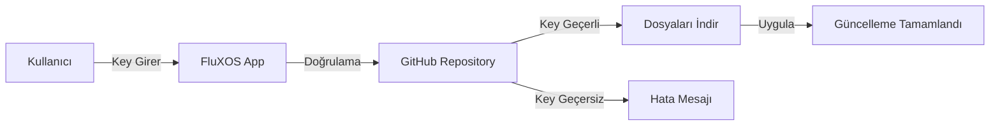

# 🚀 FluXOS Updates Repository

<div align="center">


**Resmi FluXOS Güncelleme Merkezi**

[](https://github.com/FluXX16/FluXOS-Updates)
[](LICENSE)
[]()
[](https://www.electronjs.org/)

</div>

---

## 📋 İçindekiler

- [Genel Bakış](#-genel-bakış)
- [Nasıl Çalışır?](#-nasıl-çalışır)
- [Güncelleme Kurulumu](#-güncelleme-kurulumu)
- [Repository Yapısı](#-repository-yapısı)
- [Key Türleri](#-key-türleri)
- [Sürüm Geçmişi](#-sürüm-geçmişi)
- [Geliştirici Notları](#-geliştirici-notları)

---

## 🌟 Genel Bakış

Bu repository, **FluXOS** işletim sisteminin resmi güncelleme dosyalarını barındırır. Kullanıcılar güncelleme anahtarları (update keys) kullanarak yeni özelliklere, hata düzeltmelerine ve performans iyileştirmelerine erişebilir.

### ✨ Özellikler

- 🔐 **Güvenli Güncelleme:** Anahtar tabanlı doğrulama sistemi
- 📦 **Modüler Yapı:** Sadece gerekli dosyalar güncellenir
- 🎯 **Kolay Kurulum:** Tek tıkla güncelleme
- 📝 **Detaylı Changelog:** Her güncelleme için açıklama
- 🚀 **Hızlı Dağıtım:** GitHub CDN üzerinden anında erişim

---

## 🔧 Nasıl Çalışır?



### Adım Adım Süreç

1. **Kullanıcı** FluXOS uygulamasında Ayarlar bölümüne gider
2. **Güncelleme Anahtarı** alanına key'i girer
3. **Sistem** GitHub'dan key dosyasını kontrol eder
4. **Key geçerliyse** belirtilen dosyalar indirilir
5. **Güncelleme** otomatik olarak uygulanır
6. **Uygulama** yeniden başlatılır

---

## 📥 Güncelleme Kurulumu

### Kullanıcılar İçin

<div align="center">


</div>

#### 1️⃣ FluXOS'u Açın

Uygulamanızı başlatın ve masaüstünde **⚙️ Ayarlar** ikonuna tıklayın.

#### 2️⃣ Güncelleme Bölümü

Ayarlar penceresinde **"Güncelleme Anahtarı"** bölümünü bulun.

#### 3️⃣ Key'i Girin

Size verilen güncelleme anahtarını girin:

```
FLUXOS-102-PUBLIC
```

#### 4️⃣ Uygula ve Yeniden Başlat

"🚀 Uygula" butonuna tıklayın ve güncelleme tamamlandıktan sonra uygulamayı yeniden başlatın.

### 🎥 Video Rehber

> *Yakında: Adım adım video kılavuzu eklenecek*

---

## 📁 Repository Yapısı

```
FluXOS-Updates/
│
├── 📂 keys/                      # Güncelleme anahtarları
│   ├── FLUXOS-102-PUBLIC.json
│   ├── FLUXOS-102-BETA.json
│   └── FLUXOS-103-DEV.json
│
├── 📂 updates/                   # Güncelleme dosyaları
│   ├── 📂 1.0.1/
│   │   ├── src/
│   │   │   └── js/
│   │   │       └── main.js
│   │   └── version.json
│   │
│   ├── 📂 1.0.2/
│   │   ├── src/
│   │   │   ├── index.html
│   │   │   └── js/
│   │   │       └── main.js
│   │   ├── package.json
│   │   └── version.json
│   │
│   └── 📂 1.0.3/
│       └── ...
│
└── 📄 README.md                 # Bu dosya
```

### Key Dosyası Formatı

```json
{
  "valid": true,
  "version": "1.0.2",
  "changelog": "✨ Yeni özellikler...",
  "files": [
    { "path": "src/js/main.js" },
    { "path": "src/index.html" },
    { "path": "version.json" }
  ],
  "releaseDate": "2024-12-08",
  "minVersion": "1.0.0"
}
```

---

## 🔑 Key Türleri

<div align="center">

| Tür | Format | Kullanım | Geçerlilik |
|-----|--------|----------|------------|
| 🌐 **Public** | `FLUXOS-vX.X.X-PUBLIC` | Genel kullanıcılar | ∞ Sınırsız |
| 🧪 **Beta** | `FLUXOS-vX.X.X-BETA-XXX` | Beta test kullanıcıları | ⏱️ 30 gün |
| 👨‍💻 **Developer** | `FLUXOS-vX.X.X-DEV-XXX` | Geliştiriciler | ∞ Sınırsız |

</div>

### Key Nasıl Alınır?

- **Public Keys:** [Discord Sunucumuz](https://discord.gg/fluxos) veya [Resmi Website](https://fluxos.dev)
- **Beta Keys:** Beta test programına kayıt olun
- **Developer Keys:** Geliştirici programına başvurun

---

## 📊 Sürüm Geçmişi

### 🎯 v1.0.2 - "FileManager" (2024-12-08)

<details>
<summary>📦 Detaylı Changelog</summary>

#### ✨ Yeni Özellikler
- **📁 Dosya Yöneticisi** 
  - Sanal dosya sistemi desteği
  - Klasör oluşturma ve yönetimi
  - Dosya yükleme/indirme
  - Sağ tık menüsü (Aç, Yeniden Adlandır, Sil)
  - Dosya önizleme desteği

#### 🔧 İyileştirmeler
- Pencere yönetimi optimizasyonu
- Bellek kullanımı iyileştirmeleri
- Arayüz geliştirmeleri

#### 🐛 Hata Düzeltmeleri
- Taskbar tıklama sorunu çözüldü
- Pencere sürükleme performansı iyileştirildi
- Emoji render sorunu düzeltildi

</details>

**Key:** `FLUXOS-102-PUBLIC`

---

### 📝 v1.0.1 - "Stability" (2024-11-25)

<details>
<summary>📦 Detaylı Changelog</summary>

#### 🔧 İyileştirmeler
- Sistem performans optimizasyonu
- Terminal komut sistemi iyileştirmeleri
- Paint uygulaması stabilite güncellemeleri

#### 🐛 Hata Düzeltmeleri
- Hesap makinesi bölme hatası düzeltildi
- Not defteri kaydetme sorunu çözüldü

</details>

**Key:** `FLUXOS-101-PUBLIC`

---

### 🚀 v1.0.0 - "Genesis" (2024-11-01)

İlk stabil sürüm yayınlandı! 🎉

---

## 👨‍💻 Geliştirici Notları

### Yeni Güncelleme Yayınlama

#### 1. Dosyaları Hazırlayın

```bash
# Güncelleme klasörünü oluştur
mkdir -p updates/1.0.3/src/js
mkdir -p updates/1.0.3/src/css

# Dosyaları kopyala
cp /path/to/main.js updates/1.0.3/src/js/
cp /path/to/style.css updates/1.0.3/src/css/
```

#### 2. Key Dosyası Oluşturun

```bash
# Key üretici kullan
node generate-key.js 1.0.3
```

Veya manuel oluştur: `keys/FLUXOS-103-PUBLIC.json`

```json
{
  "valid": true,
  "version": "1.0.3",
  "changelog": "Yeni özellikler...",
  "files": [
    { "path": "src/js/main.js" },
    { "path": "version.json" }
  ]
}
```

#### 3. GitHub'a Yükleyin

```bash
git add .
git commit -m "Release v1.0.3"
git push origin main
```

#### 4. Key'leri Dağıtın

- Public key'i Discord/Website'de paylaşın
- Beta key'leri test kullanıcılarına gönderin

### API Endpoint'leri

```javascript
// Key doğrulama
GET https://raw.githubusercontent.com/FluXX16/FluXOS-Updates/main/keys/{KEY_NAME}.json

// Dosya indirme
GET https://raw.githubusercontent.com/FluXX16/FluXOS-Updates/main/updates/{VERSION}/{FILE_PATH}
```

### Key Generator Script

```javascript
const crypto = require('crypto');

function generateKey(version, type = 'PUBLIC') {
  const hash = crypto.randomBytes(4).toString('hex').toUpperCase();
  return `FLUXOS-${version.replace(/\./g, '')}-${type}-${hash}`;
}

console.log(generateKey('1.0.3', 'BETA'));
// Output: FLUXOS-103-BETA-A3F2D1C4
```

---

## 🛡️ Güvenlik

### Key Güvenliği

- ❌ Key'leri asla public olarak paylaşmayın (Beta/Dev)
- ✅ Her key için rate limiting aktif
- ✅ Kullanılan key'ler loglanır
- ✅ Şüpheli aktivite durumunda key'ler iptal edilir

### İptal Edilmiş Key

```json
{
  "valid": false,
  "reason": "Bu key iptal edilmiştir",
  "expiredDate": "2024-12-01"
}
```

---

## 📞 İletişim ve Destek

<div align="center">

### Bize Ulaşın

[](https://discord.gg/t4DpPzggC7)
[](https://github.com/FluXX16/FluXOS/issues)
[](mailto:support@fluxos.dev)

### Sosyal Medya

[](https://twitter.com)
[](https://www.youtube.com/@floirant91)

</div>

---

## 📜 Lisans

Bu proje MIT lisansı altında lisanslanmıştır. Detaylar için [LICENSE](LICENSE) dosyasına bakın.

---

## 🙏 Teşekkürler

FluXOS'u kullanan ve geliştiren herkese teşekkürler! 💙

### Katkıda Bulunanlar

<div align="center">

[](https://github.com/FluXX16/FluXOS-Updates/graphs/contributors)

</div>

---

<div align="center">

**Made with ❤️ by the FluXOS Team**

[⬆ Başa Dön](#-fluxos-updates-repository)

</div>
